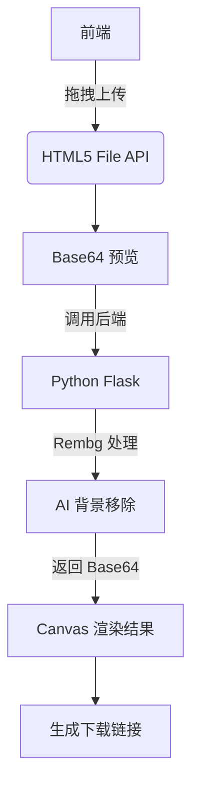

以下为采用 Markdown 格式编写的**图片背景消除 Web 工具需求文档**，严格遵循技术规范与行业最佳实践，内容聚焦功能逻辑、接口定义及实现细节，便于开发高效执行。

---

### **需求文档：基于 Python + Rembg 的图片背景消除工具**  
**版本号**：1.2  
**修订日期**：2025 年 06 月 20 日  
**技术架构**：Python Flask + Rembg + React  

---

### 一、核心目标  
> **用户价值**：通过浏览器拖拽上传图片 → 自动消除背景 → 实时预览并下载透明背景 PNG。  
> **技术指标**：  
> - 处理耗时 ≤5 秒（分辨率 ≤2000px）  
> - 支持格式：PNG/JPG/JPEG（≤10MB）  
> - 输出精度：保留毛发/复杂边缘（Alpha 通道透明）  

---

### 二、技术架构  


#### 技术栈说明  
| 模块       | 技术选型             | 核心能力说明                     |  
|------------|----------------------|----------------------------------|  
| **前端**   | React + TypeScript   | 组件化交互，状态管理高效          |  
| **后端**   | Flask + Rembg        | 微服务架构，支持 GPU 加速         |  
| **AI 引擎**| Rembg v2.0+          | `alpha_matting=True` 优化边缘细节 |  

---

### 三、功能需求详述  
#### 1. 图片上传模块  
- **交互流程**  
  ```mermaid
  graph LR
      U[用户拖拽图片] --> D[监听 drop 事件]
      D --> V[校验文件类型/大小]
      V --> P[Canvas 绘制预览图]
      P --> B[激活“消除背景”按钮]
  ```
- **关键实现**  
  - 拖拽区域样式：虚线边框 + 悬停高亮（CSS `drag-over` 状态）  
  - 文件校验：前端拦截非图片类型（`accept="image/*"`）及超限文件（10MB）  
  - 预览生成：`FileReader.readAsDataURL()` 转 Base64 渲染至 Canvas  

#### 2. AI 处理模块  
- **后端接口设计**  
  ```python
  # API: POST /api/remove-bg
  from rembg import remove
  from flask import request, jsonify
  
  @app.route('/api/remove-bg', methods=['POST'])
  def remove_bg():
      file = request.files['image']
      input_data = file.read()
      # 启用毛发边缘优化
      output_data = remove(input_data, alpha_matting=True, alpha_matting_foreground_threshold=240)
      return jsonify({"result": base64.b64encode(output_data).decode('utf-8')})
  ```
- **参数说明**  
  | 参数名                          | 作用                     | 默认值 |  
  |---------------------------------|--------------------------|--------|  
  | `alpha_matting`                 | 启用复杂边缘优化         | `True` |  
  | `alpha_matting_foreground_threshold` | 前景分割阈值             | `240`  |  

#### 3. 结果展示与下载  
- **前端逻辑**  
  ```javascript
  // 渲染透明背景图
  const img = new Image();
  img.src = `data:image/png;base64,${response.result}`;
  ctx.clearRect(0, 0, canvas.width, canvas.height);
  ctx.drawImage(img, 0, 0);
  
  // 生成下载链接
  const link = document.createElement('a');
  link.download = `nobg_${originalFilename}.png`;  // 追加 _nobg 后缀
  link.href = canvas.toDataURL('image/png');
  document.body.appendChild(link);
  ```
- **交互反馈**  
  - 处理中：进度条动画（NProgress 组件）  
  - 完成时：下载按钮绿色脉冲动效（CSS `animation: pulse 1s;`）  

---

### 四、接口规范（RESTful）  
| 端点             | 方法   | 请求参数              | 响应格式                              | 状态码         |  
|------------------|--------|-----------------------|---------------------------------------|----------------|  
| `/api/remove-bg` | POST   | `image`: File (FormData) | `{ result: base64_string }`         | 200: 成功      |  
|                  |        |                       | `{ error: "INVALID_FILE", msg: "..." }` | 400: 文件非法  |  

> **响应结构示例**：  
> ```json
> {
>   "status": "SUCCESS",
>   "result": "iVBORw0KGgoAAAANSUhEUgAA..."
> }
> ```

---

### 五、非功能性需求  
| 类别         | 要求                                                                 |  
|--------------|----------------------------------------------------------------------|  
| **性能**     | 95% 请求响应时间 ≤5 秒（4 核 CPU/8GB 内存服务器）                  |  
| **安全**     | 后端自动清除临时文件（处理完成后 1 分钟）                           |  
| **兼容性**   | Chrome/Firefox/Edge 最新版，iOS 15+/Android 11+                     |  
| **可访问性** | 支持键盘操作（Tab 切换焦点），ARIA 标签标注交互元素                |  

---

### 六、测试用例  
| 测试场景                | 输入                          | 预期输出                          |  
|-------------------------|-------------------------------|-----------------------------------|  
| 上传非图片文件          | 上传 .txt 文件                | 返回错误码 `INVALID_FILE`         |  
| 毛发边缘处理            | 人像发丝照片（2000x3000px）   | 发丝间隙透明无锯齿                |  
| 大文件超时              | 12MB JPG 文件                 | 返回错误码 `FILE_SIZE_EXCEEDED`   |  

---

> **开发资源参考**：  
> - [Rembg 官方文档](https://github.com/danielgatis/rembg)  
> - [HTML5 拖拽 API 教程](https://developer.mozilla.org/zh-CN/docs/Web/API/HTML_Drag_and_Drop_API)   
> - [Canvas 图像渲染指南](https://developer.mozilla.org/zh-CN/docs/Web/API/Canvas_API)  
